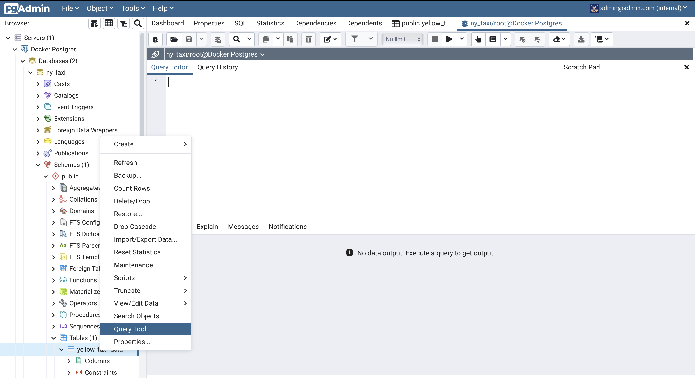

# pgAdmin and Postgres

## About

pgAdmin is a web-based GUI that makes it convenient to interact with a #Postgres #database. It is a free and open source tool with multiple installation modes.

## Start a pgAdmin container

As we are running our Postgres database containing the New York taxi rides data in a #Docker container, let us start another container that runs pgAdmin.

```bash
docker run -it \\
  -e PGADMIN_DEFAULT_EMAIL="admin@admin.com" \\
  -e PGADMIN_DEFAULT_PASSWORD="root" \\
  -p 8080:80 \\
  dpage/pgadmin4

```

We specify a default email and password that will be used to login to the application. pgAdmin will run on port 80 inside the container which we map to port 8080 on our laptop.

Once we start the container, we can navigate to `localhost:8080` in our browser, put in the default email and password defined above, and we should see the following page which is the default home screen of pgAdmin.


## Docker network

An issue with running the Postgres database and pgAdmin is that both containers have their own #network and thus cannot find each other. To get around this issue, we need to create a new Docker network and then re-run the two containers by specifying the network they should use.

We can create a new Docker network with the following command:

```bash
docker network create pg-network

```

Next, let us restart the Postgres container by specifying the network to use.

```bash
docker run -it \\
	-e POSTGRES_USER="root" \\
    -e POSTGRES_PASSWORD="root" \\
    -e POSTGRES_DB="ny_taxi" \\
    -v $(pwd)/ny_taxi_postgres_data:/var/lib/postgresql/data \\
    -p 5432:5432 \\
    --network=pg-network \\
    --name pg-db \\
  postgres:13

```

We specify the network to use using the `—network` argument. The `--name` argument becomes the host name/address of the container which we can use in #pgAdmin to access the database.

After restarting the container, it is a good idea to ensure that the database contains the records we inserted previously. We can do this in `pgcli` using the following SQL query:

```sql
select count(1) from yellow_taxi_data;

```

Next, let us restart pgAdmin with the following command:

```bash
docker run -it \\
  -e PGADMIN_DEFAULT_EMAIL="admin@admin.com" \\
  -e PGADMIN_DEFAULT_PASSWORD="root" \\
  -p 8080:80 \\
  --network pg-network \\
  --name pg-admin \\
  dpage/pgadmin4

```

Now, on the startup screen, right click on `Servers` and then select `Create -> Server`.


In the dialog that appears, give a name like “Docker Postgres”.


In the `Connection` tab, specify the host name to be name given to the Postgres container when it was started. In our case, it is `pg-db`. Then, specify the username and password for the database which is `root` and `root` in our case. Then, click on `Save`.


Now, in the navigation pane on the left, we should see our server (`Docker Postgres`). Expanding it to `Databases -> ny_taxi -> Schemas -> public -> Tables`, we should see our table `yellow_taxi_data`. We can see a preview of this table by right clicking on it and then selecting `View/Edit Data -> First 100 rows`.


We can run custom queries on this table by right clicking on it and selecting `Query Tool`.




## References

- [DE Zoomcamp 1.2.3 - Connecting pgAdmin and Postgres](https://www.youtube.com/watch?v=hCAIVe9N0ow&list=PL3MmuxUbc_hJed7dXYoJw8DoCuVHhGEQb&index=6)
- [pgAdmin](https://www.pgadmin.org/)
