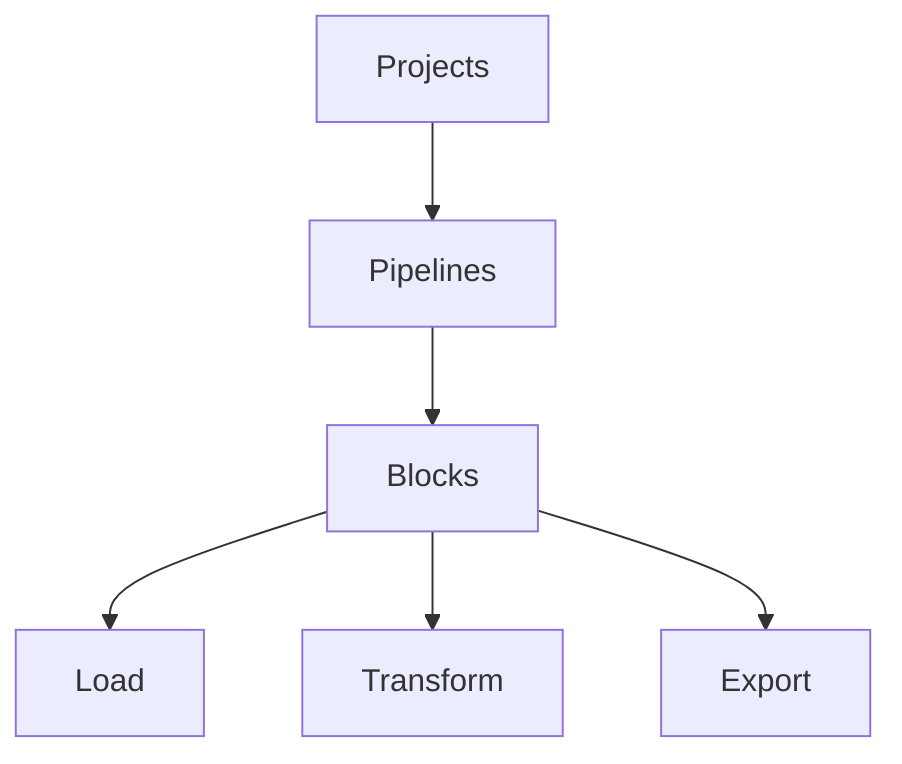

# Introduction to Mage

*Note*: For all references to code in the following material, refer to the following GitHub folder: 

[](https://github.com/tejas-kale/data_engineering_zoomcamp/tree/main/code/week_2)

## About

Mage is an open-source tool that helps with orchestration, transformation, and integration of data. The following concepts are important to know before working with Mage:



- A *project* is akin to a GitHub repository i.e. it is a collection of pipeline, blocks, and other assets. One or more projects can belong to a Mage instance.
- Each pipeline is a workflow consisting of multiple blocks and charts. It is represented by a YAML file in our project. A block can be written either in SQL, Python, or R.
- A block is a script that is executed by Mage once its upstream dependencies are fulfilled. Blocks can be reused in multiple places so changing a block will modify its behaviour in all places where it is used. A block can be used to do any task from a simple data transformation to training a complex machine learning model.

## Features

Mage comes equipped with tools out of the block including:

- Sensors (that trigger on events)
- Conditionals (branching logic)
- Dynamics
- Webhooks

Mage also provides additional functionality including:

- Data integration
- Unified pipelines
- Multi-user environments
- Templating

## Mage and developer experience

We can develop pipelines with Mage either using the GUI or with the help of blocks i.e. reusable code. This allows us to:

- Code and test in parallel
- Reduce tool dependencies and context switching

Mage also has engineering best practices built-in using features like:

- In-line testing and debugging using a notebook-style format
- Complete observability with support for other tools like dbt, streaming, etc.
- Application of DRY principles with reusable blocks

Overall, Mage allows us to focus on creating *differentiated work*. 

## Anatomy of a block

Each block consists of the following sections:

- Package imports
- Decorator
- Function (that always returns a dataframe)
- Test (on the output dataframe of the block)

In a block, only the function marked by specific decorators gets executed.

## Mage configuration

In order to understand how to configure Mage, clone the [mage-zoomcamp](https://github.com/mage-ai/mage-zoomcamp) repository. First, replace the `dev.env` file to `.env` so that it is ignored by Git by default. This is important as this file might contain sensitive information that we want to avoid committing to version control.

Next, build a Docker container using the command:

```bash
docker compose build
```

*Note*: In the Mage UI, if we see an *Update Now* button, we should pull the latest Mage container using the command:

```bash
docker pull mageai/mageai:latest
```

Next, we start the container.

```bash
docker compose up
```

Now we can go to the Mage UI by visiting `[localhost:6789](http://localhost:6789)` in the browser. Even if we run the service in a GitHub Codespace, if we are running VS Code, automatic port forwarding is done so that Mage can still be accessed by going to `localhost:6789`.

Once we go to the UI, we should see the Pipelines page as shown below. The pipelines are part of the `magic-zoomcamp` project, a name that comes from the `.env` file (`PROJECT_NAME` parameter).

Given the configuration in the `docker-compose.yml` file, the Mage installation is created in the same directory as where we build the container from. All Mage configuration resides in this directory, which is named after the project (`magic-zoomcamp`) in this case, inside the `io_config.yml` file. 

Mage configuration can be divided into profiles with the default profile called `default`. We can add additional profiles like `dev` in the same YAML file.

## Example pipeline

On the UI, we should be able to see an `example_pipeline` which when clicked on shows a simple 3 step pipeline that fetches data from an API, fills in missing values, and exports the data to a dataframe. To see a tree view of the pipeline, we can click on the *Edit pipeline* button in the left-hand pane.

From looking at the tree of the pipeline, we can see that the 3 steps are connected to each other. It means that the input for a block (except the first one) is a dataframe which is the output of the previous block.

## What happens after we start containers?

When we execute `docker compose up`, two containers are spawned - one running a Postgres database and the other running Mage. Both containers are configured with Postgres database variables defined in the `.env` file. Any additions or modifications done using the Mage UI are in the container and not in our local machine or Codespace. Hence, it is easier to do any Mage-related changes in the editors provided as part of Mage UI. 

For example, to test our connection to the Postgres server running another container, we can follow these steps in the UI:

- In the *Pipelines* section, click on *New* and *Standard (batch)*.
- In the *Edit* menu, click on *Pipeline settings,* change the pipeline name to `test_config`, and click on *Save pipeline settings*.
- Go to the *Edit pipeline* area, click on *Data loader* followed by *SQL*.
- In the SQL editor that shows up, modify the connection name to *PostgreSQL* and the profile to *dev*.
- Enter `SELECT 1;` in the editor and run the block. Verify the output is a single row consisting of the value `1`.

## Adding data to Postgres

To set up a pipeline in Mage that downloads a CSV file from the web and inserts it into a Postgres database, let us first create a new pipeline in the Mage UI.

- In the *Pipelines* section, click on *New* and *Standard (batch)*.
- In the *Edit* menu, click on *Pipeline settings,* change the pipeline name to `test_config`, and click on *Save pipeline settings*.
- Go to the *Edit pipeline* area, click on *Data loader* followed by *Python* and *API*. Name the file `load_api_data`.
- In the `load_data_from_api()` function, set the `url` value to `https://github.com/DataTalksClub/nyc-tlc-data/releases/download/yellow/yellow_tripdata_2021-01.csv.gz`.
- Now define the data type of each column so that we can speed up the reading of the CSV file as a Pandas dataframe.
- Next, specify the datetime columns in a list.
- Read the CSV using Pandas’ `read_csv()` function. We specify the column separator to be a comma and the compression type to be `gzip`. We also pass the data types defined in the previous step as the `dtype` argument and the datetime columns as `parse_dates` arguments.
- We also use the default inline test (`test_output()`) to check that the output of the data loader function is not undefined.
- Now, we run the block and ensure that we get a clean table output.
- Next, below this block, we click on *Transformer* followed by *Python* and *Generic.* We call it `transform_taxi_data`.
- In this block, we first print the rows with `passenger_count = 0` and then drop them.
- Next, we add a test to ensure that the resultant dataframe does not have any row with `passenger_count = 0`.
- Following this block, we click on *Data Exporter* followed by *Python* and *PostgreSQL*. Thus, we create a block to save our dataframe to a Postgres table.
- In the exporter block, we first specify the schema name (`ny_taxi`), table name (`yellow_taxi_data`), and config profile (`dev`).
- Finally, we create a new *Data Loader* block with *SQL.* In this block, we select the connection to be *PostgreSQL* and the profile as *dev*. We also select the *Use raw SQL* checkbox and query `select * from ny_taxi.yellow_taxi_data limit 5;`. If the output is a table, we can be confident that the data loading, transformation, and writing process is getting executed correctly.

## GCP configuration

To create GCP resources using code, we need to install Terraform. On GitHub Codespace, we can do so using the following commands ([source](https://developer.hashicorp.com/terraform/install?product_intent=terraform)):

```bash
wget -O- https://apt.releases.hashicorp.com/gpg | sudo gpg --dearmor -o /usr/share/keyrings/hashicorp-archive-keyring.gpg
echo "deb [signed-by=/usr/share/keyrings/hashicorp-archive-keyring.gpg] https://apt.releases.hashicorp.com $(lsb_release -cs) main" | sudo tee /etc/apt/sources.list.d/hashicorp.list
sudo apt update && sudo apt install terraform
```

We need two GCP resources - a Google Cloud Storage bucket and a Google BigQuery dataset. We can do so either using the Google Cloud Console UI or Terraform. If using Terraform, it is essential that we use the same service account that we use in Mage to create the resources. To create a service account:

- In the Google Cloud Console, we go to *IAM and admin* and then *Service accounts*.
- Next, we click on *Create Service Account*, give it a name, and grant it the following roles:
    - BigQuery Admin
    - Compute Admin
    - Storage Admin
    - Storage Object Admin
    - Viewer
    - *Note*: These are high privileges that are alright for learning during a course but should never be provided in a work environment.
- Once the account is created, we click on it in the table, navigate to the *Keys* tab and click on *Add Key*. We select *JSON* and download the generated JSON file.

The service account now contains the credentials and permissions to modify our storage bucket and BigQuery dataset. We copy the downloaded JSON file to our Mage project and add it to `.gitignore`. When a Mage container is created, this file gets automatically copied to the container in the `/home/src` directory as specified in `docker-compose.yml`.

To provide Mage with GCP access, we specify the path to the service account JSON inside the container in the `io_config.yaml` file (property `GOOGLE_SERVICE_ACC_KEY_FILEPATH`). We also delete the configuration above this property till `# Google`.

## Adding data to GCS

Previously, we used Mage to add taxi trip data to a Postgres database. Now that we have configured Mage to access GCP, let us add the same data to a storage bucket. Here, we reuse the data loader and transformer blocks from earlier as these blocks are just Python scripts under the hood.

We create a new data exporter block by selecting *Data exporter* followed by *Python* and *Google Cloud Storage*. We call the block `taxi_data_to_gcs_parquet` and provide the bucket name (`dez_mage_august-cirrus-399913`). We specify `object_key` to be `nyc_taxi_data.parquet` thereby saving the data to a Parquet file.

We can now run the new block along with the previous ones using the *Execute with all upstream blocks* option. Once the block’s execution is complete, the above references Parquet file should be present in our bucket.

For large data, it is not advisable to write the entire data to a single Parquet file. Instead, we partition the data (often by timestamp) and then save it to files. To do so, we can create a new block by clicking on *Data exporter* followed by *Python* and *Generic*. We can call the block `taxi_data_to_gcs_partitioned_parquet`. In this block:

- Import the `pyarrow` package which is used to partition the data.
- Add the service account JSON as an environment variable (`GOOGLE_APPLICATION_CREDENTIALS`)
- Specify the project ID, bucket name, table name, and root path i.e. `f"{BUCKET_NAME}/{TABLE_NAME}"`.
- In order to partition the data by date, we create a new date column based on the `tpep_pickup_datetime` column.
- Create a Pyarrow table from the Pandas dataframe, create a `pa.fs.GcsFileSystem()` object and then write the table to GCS.

Once this block is executed successfully, we can see a folder in our bucket which consists of one folder for each date in the data. Inside the sub-folder, we have one or more Parquet files.

## Adding data to BigQuery

In order to load data from a storage bucket to a BigQuery table, we can create a new pipeline (say `gcs_to_bigquery`) consisting of the following blocks:

- A data loader block (*Data loader* → *Python* → *Google Cloud Storage*) that read the single Parquet file we saved previously.
- A transformation block (*Transformer* → *Python* → *Generic*) that replaces spaces in column names with underscores and converts all characters in column names to lower case.
- A data exporter block (*Data exporter* → *SQL*) in which we specify:
    - Connection as *BigQuery*
    - Profile as *default*
    - Schema as `ny_taxi`
    - Table as `yellow_taxi_data`
    - Load the data from the previous step by referencing `df_1` i.e. `select * from {{ df_1 }}`.
- In order to schedule a pipeline, we can navigate to the *Triggers* section and click on *New trigger*. After selecting the type as *Schedule*, we can give the trigger a name and specify the frequency with which the pipeline should be executed.

## Parameterised execution

Mage supports different types of variables like runtime, global, etc. that can be specified for pipelines. Runtime variables are input to every Mage block as `kwargs` . One such variable is `execution_date` which can be fetched using `kwargs.get("execution_date")` . This can be used to add data to a specify Parquet partition as an alternative to using PyArrow which we did earlier.

If we execute pipelines through the API, we can pass parameters for execution. In the *Edit pipeline* view, we can add variables by selecting the *Variables* tab on the right. Runtime variables can also be specified when defining a trigger.

Variables can also be used to synchronise execution between blocks.

## Backfills

Previously, we created a pipeline that saved the data to GCS partitioned by execution date. If we start the execution in the middle of our project and wish to execute the same parameterised logic to ingest data in the past, we can make use of the backfill functionality provided by Mage. 

In the *Backfills* tab seen in the left-hand pane, we click on *Create a new backfill* which selects the Date and time window backfill by default. After we specify the start and end time along with the interval frequency, Mage will automatically create runs of the pipeline for the specified duration with the correct runtime variables. For example, if we create a backfill between Jan 1 and Jan 5, 2024 with an interval of 1 day, Mage will create 6 runs getting the `execution_time`  variable from Jan 1 to Jan5, 2024 respectively.

## Deploying to GCP

In order to deploy Mage to GCP using Terraform, the prerequisites are:

- Terraform
- `gcloud cli`
    - [Installation instructions](https://cloud.google.com/sdk/docs/install)
    - To check the installation, run `gcloud auth list`  and ensure that our email address is shown.
    - In case of any errors, login using the command `gcloud auth login` .
- Google Cloud permissions
    - In the *IAM and admin* section, we edit the permissions of our service account by adding the following roles:
        - Artifact Registry Reader
        - Artifact Registry Writer
        - Cloud Run Developer
        - Cloud SQL Admin
        - Service Account Token Creator
    - Enable *Cloud Firestore API*
- Mage Terraform templates
    - [mage-ai-terraform-templates](https://github.com/mage-ai/mage-ai-terraform-templates)

Once all the prerequisites are fulfilled, we navigate to the `gcp` directory in the Terraform templates repository or directory and update the default value of the following variables in `variables.tf` :

- `project_id`
- `region`
- `zone`

Next, we create the resources using the following commands:

```bash
terraform init
terraform plan
terraform apply
```

While creating the resources, we need to provide a password for our Postgres database. In total, 21 resources are added. Creation of the SQL instance `mage-data-prep-db-instance`  can take a long time, up to 10 minutes. 

At present, I am unable to create a running Mage instance on GCP due to an [error](https://gist.github.com/tejas-kale/7a93ff68a0926cae00a88c3c6b860f13). I have posted about it in the course Slack channel and hope to receive hints to resolve the issue soon.

## Deploying to DigitalOcean

We can also deploy Mage to DigitalOcean with the following prerequisites:

- DigitalOcean account
- SSH key
    - We can create a key using this [tutorial](https://www.ssh.com/academy/ssh/keygen).
- Personal Access Token in DigitalOcean with *write* access
    - We can create a token using this [tutorial](https://developer.hashicorp.com/terraform/tutorials/applications/digitalocean-provider#generate-digitalocean-access-token).
    - We set the token to `DIGITALOCEAN_ACCESS_TOKEN` as an environment variable.
- Mage Terraform templates
    - [mage-ai-terraform-templates](https://github.com/mage-ai/mage-ai-terraform-templates)

Once all the prerequisites are fulfilled, we navigate to the `digitalocean`  directory in the Terraform templates repository or directory and update the default value of the following variables in `variables.tf` :

- Path to `ssh_pub_key`

Next, we create the resources using the following commands:

```bash
terraform init
terraform plan
terraform apply
```

5 resources get created in DigitalOcean and the IP address of the droplet which can be used to run Mage is also printed in the console. After noting the IP, we login to our droplet using SSH:

```bash
ssh -i ~/.ssh/<ssh_keygen_private_file> root@<ip>
```

After logging in, we start Mage using the following command:

```bash
docker run -d -p 6789:6789 -v $(pwd):/home/src mageai/mageai /app/run_app.sh mage start default_repo
```

We can now view at Mage UI at `<ip>:6789` .

## Resources

- [What is Orchestration?](https://www.youtube.com/watch?v=Li8-MWHhTbo&list=PL3MmuxUbc_hJed7dXYoJw8DoCuVHhGEQb)
- [What is Mage?](https://www.youtube.com/watch?v=AicKRcK3pa4&list=PL3MmuxUbc_hJed7dXYoJw8DoCuVHhGEQb)
- [Configure Mage](https://www.youtube.com/watch?v=tNiV7Wp08XE)
- [A Simple Pipeline](https://www.youtube.com/watch?v=stI-gg4QBnI&list=PL3MmuxUbc_hJed7dXYoJw8DoCuVHhGEQb)
- [Configuring Postgres](https://www.youtube.com/watch?v=pmhI-ezd3BE&list=PL3MmuxUbc_hJed7dXYoJw8DoCuVHhGEQb)
- [ETL: API to Postgres](https://www.youtube.com/watch?v=Maidfe7oKLs&list=PL3MmuxUbc_hJed7dXYoJw8DoCuVHhGEQb)
- [Terraform](https://developer.hashicorp.com/terraform/install?product_intent=terraform)
- [Configuring GCP](https://www.youtube.com/watch?v=00LP360iYvE&list=PL3MmuxUbc_hJed7dXYoJw8DoCuVHhGEQb)
- [ETL: API to GCS](https://www.youtube.com/watch?v=w0XmcASRUnc&list=PL3MmuxUbc_hJed7dXYoJw8DoCuVHhGEQb)
- [ETL: GCS to BigQuery](https://www.youtube.com/watch?v=JKp_uzM-XsM)
- [Parameterized execution](https://www.youtube.com/watch?v=H0hWjWxB-rg&list=PL3MmuxUbc_hJed7dXYoJw8DoCuVHhGEQb)
- [Backfills](https://www.youtube.com/watch?v=ZoeC6Ag5gQc&list=PL3MmuxUbc_hJed7dXYoJw8DoCuVHhGEQb&index=28)
- [Deployment prerequisites](https://www.youtube.com/watch?v=zAwAX5sxqsg&list=PL3MmuxUbc_hJed7dXYoJw8DoCuVHhGEQb&index=28)
- [Google Cloud permissions](https://www.youtube.com/watch?v=O_H7DCmq2rA&list=PL3MmuxUbc_hJed7dXYoJw8DoCuVHhGEQb&index=29)
- [Deploying to Google Cloud Part 1](https://www.youtube.com/watch?v=9A872B5hb_0&list=PL3MmuxUbc_hJed7dXYoJw8DoCuVHhGEQb&index=30)
- [Deploying to Google Cloud Part 2](https://www.youtube.com/watch?v=0YExsb2HgLI&list=PL3MmuxUbc_hJed7dXYoJw8DoCuVHhGEQb&index=31)
- [Next steps](https://www.youtube.com/watch?v=uUtj7N0TleQ&list=PL3MmuxUbc_hJed7dXYoJw8DoCuVHhGEQb&index=32)
- [Deploy to DigitalOcean with Terraform](https://docs.mage.ai/production/deploying-to-cloud/digitalocean/setup)