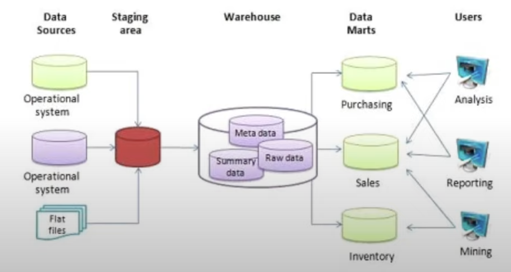

# Data Warehouse and BigQuery

## OLAP vs OLTP

*OLTP*: Online Transaction Processing
*OLAP*: Online Analytical Processing

|  | OLTP | OLAP |
| --- | --- | --- |
| Purpose | Control and run essential business operations in real time | Plan, solve problems, support decisions, discover hidden insights |
| Data updates | Short, fast updates initiated by user | Data periodically refreshed with scheduled, long-running batch jobs |
| Database design | Normalised databases for efficiency | Denormalised databases for analysis |
| Space requirements | Generally small if historical data is archived | Generally large due to aggregating large datasets |
| Backup and recovery | Regular backups required to ensure continuity and meet legal and governance requirements | Lost data can be reloaded from OLTP database as needed in lieu of regular backups |
| Productivity | Increases productivity of end users | Increases productivity of business managers, data analysts, and executives |
| Data view | Lists day-to-day business transactions | Multi-dimensional view of enterprise data |
| User examples | Customer-facing personnel, clerks, online shoppers | Knowledge workers such as data analysts, business analysts, and executives |

## Data warehouse

A *data warehouse* is an OLAP solution primarily used for reporting and data analysis.



## BigQuery

- A serverless data warehouse i.e. no servers to manage or database software to install.
- Highly scalable and high availability
- Comes with built-in features including machine learning, geospatial analysis, and business intelligence
- Maximises flexibility by separating compute from storage


In BigQuery, the first level of grouping is the *project*. Within each project, we can have multiple *databases*, and each database can contain multiple *tables*. We can search for public datasets as well by putting its name or the table name in the search box and searching in all projects.


A sample query for this public data is entered below:

```sql
SELECT station_id, name FROM `bigquery-public-data.new_york_citibike.citibike_stations` LIMIT 1000

```

BigQuery pricing is as follows:

- *On demand*: $5 for every 1TB of processed data.
- *Flat rate*: based on pre-requested slots.

We can create an external table that refers to data files in GCS as follows:

```sql
CREATE OR REPLACE EXTERNAL TABLE `taxi-rides-ny.nytaxi.external_yellow_tripdata`
OPTIONS (
	format = 'CSV',
	uris = ['gs://nyc-tl-data/trip data/yellow_tripdata_2019-*.csv', 'gs://nyc-tl-data/trip data/yellow_tripdata-2020-*.csv']
);

SELECT *
FROM taxi-rides-ny.nytaxi.external_yellow_tripdata
LIMIT 10;

```

When reading this data, BigQuery automatically guesses the schema and also allows us to modify this schema. For external tables though, BigQuery cannot provide the number of rows or table size in the *Details* tab of the console.

### Partitioning in BigQuery

By default, data in BigQuery is partitioned by date. Proper partitioning of data ensures that only the relevant segment of the data is scanned in a query thus saving costs and reducing query time significantly.


A sample query to create a partitioned table is shown below:

```sql
CREATE OR REPLACE TABLE taxi-rides-ny.nytaxi.yellow_tripdata_partitioned
PARTITION BY
	DATE(tpep_pickup_datetime) AS
SELECT * FROM taxi-rides-ny.nytaxi.external_yellow_tripdata;

```

In the BigQuery interface, partitioned tables are denoted by an icon that has a gap in the table rows while the non-partitioned tables are denoted by a solid table icon. To get information on the partitions, we can use the query:

```sql
SELECT table_name, partition_id, total_rows
FROM `nytaxi.INFORMATION_SCHEMA.PARTITIONS`
WHERE table_name = "yellow_tripdata_partitioned"
ORDER BY total_rows DESC;

```

Columns used to partition tables in BigQuery can be one of:

- Time-unit column
- Ingestion time (`_PARTITIONTIME`)
- Integer range

For time-unit or ingestion time partition, the default partition frequency is *daily*. It can be increased to hourly, monthly, or yearly. There cannot be more than 4000 partitions. Hence, for hourly partitions, an *expiring partition* strategy is recommended.

### Clustering in BigQuery

Along with partitioning, BigQuery provides support for clustering rows by different columns which further speeds up query execution and reduces costs. A sample query to create a partitioned and clustered table is shown below:

```sql
CREATE OR REPLACE TABLE taxi-rides-ny.nytaxi.yellow_tripdata_partitioned_clustered
PARTITION BY DATE(tpep_pickup_datetime)
CLUSTER BY VendorID AS
SELECT * FROM taxi-rides-ny.nytaxi.external_yellow_tripdata;

```

In clustering, the specified columns are used to colocate data. The order in which columns are specified is important as it acts as the sort order of columns. With clustering, filtering and aggregation query processing is improved although no significant improvement is seen for data less than 1GB in size. In fact, as partitioning and clustering incur metadata read and maintenance costs, they are not recommended for small data i.e. < 1GB. Up to 4 clustering columns can be specified.

Clustering columns should be top-level and non-repeating belonging to the following types:

- DATE
- BOOL
- GEOGRAPHY
- INT64
- NUMERIC
- BIGNUMERIC
- STRING
- TIMESTAMP
- DATETIME

### Clustering vs Partitioning

| Clustering | Partitioning |
| --- | --- |
| Cost benefit unknown | Cost known upfront |
| You need more granularity than partitioning alone allows | You need partition-level management |
| Your queries commonly use filters or aggregation against multiple particular columns | Filter or aggregate on single columns |
| The cardinality of the number of values in a column or group of columns is large. |  |

Clustering is preferred to partitioning when:

- the amount of data per partition is less than 1GB.
- the number of partitions is greater than 4000.
- the mutate operations modify multiple partitions at once.

### Automatic re-clustering

As new data is inserted into a table, it is written to blocks whose key ranges overlap with the key ranges of previously written blocks leading to a weakening of the sort property of the table. To handle this, BigQuery performs automatic re-clustering in the background to restore the sort property of the table. For partitioned tables, clustering is maintained within the scope of the partition. This operation is performed by BigQuery without any cost to the user.

### Best practices

To reduce BigQuery costs, some tips are:

- Avoid `SELECT *`
    - BigQuery stores data as columns so specifying columns ensures that only data for specified columns is read.
- Price queries before running them
    - This information is shown at the top right of the query editor.
    
    
    
- Use clustered or partitioned tables
- Use streaming inserts with caution
- Materialise query results in stages
    
    <aside>
    💡 **What does materialising a query mean?**
    
    Materializing a query refers to storing the results of a query as a separate table or view. Instead of running the query every time it is needed, the results are pre-calculated and stored, allowing for faster access and reducing the need for repeated query execution. Materializing a query can be useful when the underlying data is relatively static or when the query is computationally intensive.
    
    </aside>
    

To improve query performance, some tips are:

- Filter on partition columns
- Denormalise data
- Use nested or repeated columns
    - It helps with denormalising data.
- Use external data sources appropriately
    - Don’t use them when high query performance is needed.
    
    <aside>
    💡 **When should one use external tables in BigQuery and when should they be avoided?**
    
    External tables in BigQuery should be used when you want to query data that is stored outside of BigQuery, such as in Google Cloud Storage (GCS). They provide a convenient way to access and analyze data without needing to load it into a native BigQuery table.
    
    External tables are beneficial in the following scenarios:
    
    - **Cost efficiency**: If you have large amounts of data that is infrequently accessed, you can store it in GCS and create an external table in BigQuery to query it on-demand. This can help reduce storage costs in BigQuery.
    - **Data integration**: If you have data stored in different formats or locations, you can use external tables to query and join them together in BigQuery. This allows for a unified view of the data without the need for complex data integration processes.
    - **Data sharing**: External tables can be shared with other projects or users, providing controlled access to the data without granting access to the underlying storage location.
    
    However, there are situations where external tables should be avoided:
    
    - **Real-time or high-performance requirements**: External tables have some limitations compared to native BigQuery tables, such as slower query performance and limited support for certain features like clustering and partitioning. If you have real-time or high-performance requirements, it is recommended to load the data into native BigQuery tables instead.
    - **Frequent updates or writes**: External tables are read-only, meaning you cannot modify the data directly through BigQuery. If you have data that requires frequent updates or writes, it is better to load it into native BigQuery tables that support data modification.
    - **Sensitive or confidential data**: While external tables provide access control mechanisms, they still rely on the underlying storage system for security. If you have sensitive or confidential data, it is important to consider the security measures in place for the storage system.
    
    In summary, external tables in BigQuery are useful for cost-efficient querying of infrequently accessed or distributed data. However, they may not be suitable for real-time or high-performance requirements, frequent data updates, or sensitive data scenarios where additional security measures are needed.
    
    </aside>
    
- Reduce data before using a JOIN
- Do not treat WITH clauses as prepared statements
- Avoid oversharding tables
- Avoid JavaScript user defined functions
- Use approximate aggregation functions
- Order rows at the end to maximise performance
- Optimise JOIN patterns
- As a best practice, place the table with the largest number of rows first, followed by the table with the fewest rows. Place the remaining tables in descending order.
    
    <aside>
    💡 **In BigQuery, as a best practice, it is recommended to have the table with the largest number of rows first joined to the table with the fewest rows. Why is that?**
    
    In BigQuery, it is recommended to have the table with the largest number of rows first joined to the table with the fewest rows for performance optimization. This approach allows the data to be distributed across different nodes automatically and the table with the fewest rows can be broadcasted to all nodes. By distributing the data and broadcasting the smaller table, BigQuery can efficiently process the join operation and minimize data movement between nodes, resulting in improved query performance.
    
    </aside>
    

### Internals

- The data is stored in a separate storage called *Colossus* which is cheap and saves data in columnar format.
- Separating the data from compute significantly reduces cost and provides advantage to BigQuery.
- With compute and data belonging to separate pieces of hardware, the *Jupiter* network, available in BigQuery data centres, provides speeds of 1TB/sec which nearly gets rid of any query latency.
- *Dremel* is BigQuery’s query execution engine that constructs a tree from a query with each node executing a query subset.


- Record-oriented storages (row storages) are easy to understand and its examples include CSV files. In column-oriented storages, the same rows are available in different columns.
- The typical query processing in Dremel is shown by the diagram below. It is important to note here that only the leaf nodes directly access the data in Colossus.


## Machine Learning in BigQuery

Aimed at data analysts and managers, implementing machine learning (ML) models in BigQuery does not require any programming or data export. 10GB of data storage and 1TB of queries are free per month for ML in BigQuery. Even for the *Create Model* step, first 10GB of data storage is free.

Once data is collected, any model building process in ML involves the following steps:

- Feature engineering
- Splitting of data into training, validation, and test sets
- Model selection and hyper-parameter tuning
- Model validation

BigQuery helps with the ML lifecycle in the following ways:

- Automatic feature engineering
- Data splitting
- Choice of models
- Hyperparameter tuning
- Metrics for model validation
- Model deployment using Docker

BigQuery provides the following model selection guide as a reference.

[ml-model-cheatsheet.pdf](../../../../Downloads/b2a425cb-c79d-49cc-abda-8690787f2054_Export-80705006-91c5-4812-8ef0-e4f2971749ef/Data%20Warehouse%20and%20BigQuery%20150ef07fbb804440a16dcc07eac3f0a1/ml-model-cheatsheet.pdf)

In order to play around with ML in BigQuery, we use the yellow taxi data.

```sql
SELECT passenger_count, trip_distance, pulocationid, dolocationid, fare_amount, tip_amount
FROM `august-cirrus-399913.ny_taxi.yellow_taxi_data`
WHERE fare_amount != 0;
```

BigQuery supports automatic and manual [preprocessing](https://cloud.google.com/bigquery/docs/preprocess-overview). The former involves standardising numeric columns and converting categorical columns to one-hot encodings. With manual preprocessing, we get to apply a wider group of functions including bucketize, min-max scaler, polynomial expansion, etc.

In the example below, we create a new table for creating a ML model. As we specify the table schema, any columns in the source data that do not match the data type provided in the schema get automatically coerced to the recommended type.

```sql
CREATE OR REPLACE TABLE `august-cirrus-399913.ny_taxi.yellow_tripdata_ml` (
`passenger_count` INTEGER,
`trip_distance` FLOAT64,
`PULocationID` STRING,
`DOLocationID` STRING,
`payment_type` STRING,
`fare_amount` FLOAT64,
`tolls_amount` FLOAT64,
`tip_amount` FLOAT64
) AS (
SELECT passenger_count, trip_distance, cast(PULocationID AS STRING), CAST(DOLocationID AS STRING),
CAST(payment_type AS STRING), fare_amount, tolls_amount, tip_amount
FROM `august-cirrus-399913.ny_taxi.yellow_taxi_data` WHERE fare_amount != 0
);
```

After creating the data, the next step is to define the model. In the example below, a simple linear regression model is demonstrated. Using this model, we try to predict the tip amount to the driver. 

- Note that model creation takes a few minutes.

```sql
CREATE OR REPLACE MODEL `august-cirrus-399913.ny_taxi.tip_model`
OPTIONS
(model_type='linear_reg',
input_label_cols=['tip_amount'],
DATA_SPLIT_METHOD='AUTO_SPLIT') AS
SELECT
*
FROM
`august-cirrus-399913.ny_taxi.yellow_tripdata_ml`
WHERE
tip_amount IS NOT NULL;
```

A summary of the input features used in the model can be seen using the code below.

```sql
SELECT * FROM ML.FEATURE_INFO(MODEL `august-cirrus-399913.ny_taxi.tip_model`);
```

The model shows up the *Models* section of the `ny_taxi` database. In the *Details* tab, we can see the model type and other information about the model and its data. In the *Training* tab, we can keep track of the model loss and metrics. In the *Evaluation* tab, model metrics are shown in a tabular form.

The model can be evaluated against training data using the following code:

```sql
SELECT
*
FROM
ML.EVALUATE(MODEL `august-cirrus-399913.ny_taxi.tip_model`,
(
SELECT
*
FROM
`august-cirrus-399913.ny_taxi.yellow_tripdata_ml`
WHERE
tip_amount IS NOT NULL
));
```

To predict the tip amount based on the model, we run the following SQL query:

```sql
SELECT
*
FROM
ML.PREDICT(MODEL `august-cirrus-399913.ny_taxi.tip_model`,
(
SELECT
*
FROM
`august-cirrus-399913.ny_taxi.yellow_tripdata_ml`
WHERE
tip_amount IS NOT NULL
));
```

Using the explain and predict functionality of ML in BigQuery, we can get the list of top 4 features prominently used during training.

```sql
SELECT
*
FROM
ML.EXPLAIN_PREDICT(MODEL `august-cirrus-399913.ny_taxi.tip_model`,
(
SELECT
*
FROM
`august-cirrus-399913.ny_taxi.yellow_tripdata_ml`
WHERE
tip_amount IS NOT NULL
), STRUCT(3 as top_k_features));
```

In order to tune our model hyperparameters, we use the following code:

```sql
CREATE OR REPLACE MODEL `august-cirrus-399913.ny_taxi.tip_hyperparam_model`
OPTIONS
(model_type='linear_reg',
input_label_cols=['tip_amount'],
DATA_SPLIT_METHOD='AUTO_SPLIT',
num_trials=5,
max_parallel_trials=2,
l1_reg=hparam_range(0, 20),
l2_reg=hparam_candidates([0, 0.1, 1, 10])) AS
SELECT
*
FROM
`august-cirrus-399913.ny_taxi.yellow_tripdata_ml`
WHERE
tip_amount IS NOT NULL;
```

To deploy our trained machine learning to BigQuery, we need to follow these steps:

1. Authenticate with Google Cloud
2. Copy model to a storage bucket

```bash
bq --project_id august-cirrus-399913 extract -m ny_taxi.tip_model gs://taxi_ml_model/tip_model
```

1. Create a temporary directory `/tmp/model`
2. Copy the model to the temporary directory

```bash
gsutil cp -r gs://taxi_ml_model/tip_model /tmp/model
```

1. Create a serving directory

```bash
mkdir -p serving_dir/tip_model/1
cp -r /tmp/model/tip_model/* serving_dir/tip_model/1
```

1. Pull the `tensorflow/serving` image and run it.
2. Run the following command:

```bash
docker run -p 8501:8501 --mount type=bind,source=pwd/serving_dir/tip_model,target= /models/tip_model -e MODEL_NAME=tip_model -t tensorflow/serving &
```

1. Once the prediction endpoint is running, anyone can authenticate to the endpoint and given the input values get a prediction from the model.

```bash
curl -d '{"instances": [{"passenger_count":1, "trip_distance":12.2, "PULocationID":"193", "DOLocationID":"264", "payment_type":"2","fare_amount":20.4,"tolls_amount":0.0}]}' -X POST http://localhost:8501/v1/models/tip_model:predict
```
